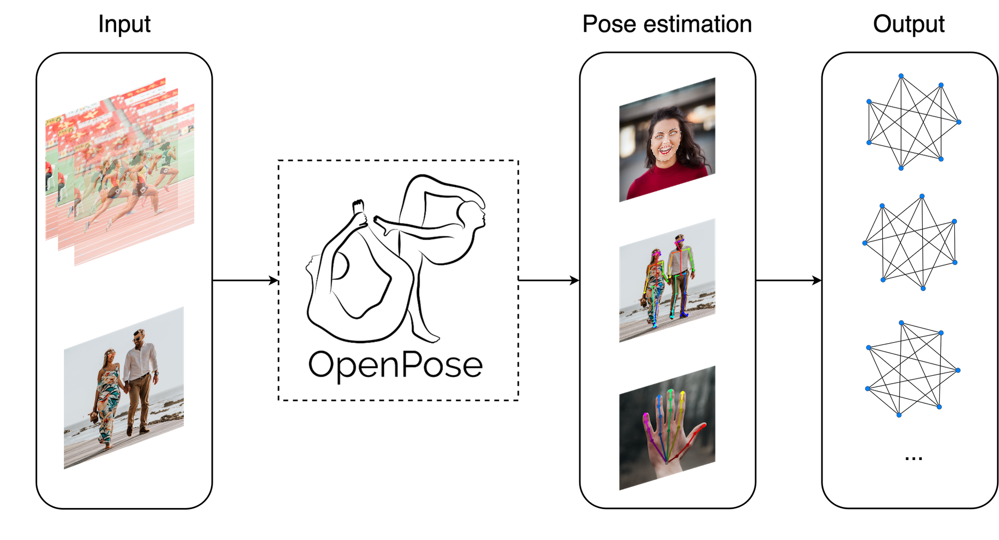

[![Contributors][contributors-shield]][contributors-url]
[![MIT License][license-shield]][license-url]
<!--[![LinkedIn][linkedin-shield]][linkedin-url]-->

<!-- PROJECT LOGO -->
<br />
<p align="center">
  <a href="https://github.com/gabecarra/GraphPipe">
    
  </a>
    <p align="center">
      Graph Representations to Model Physical Systems
      <br>
      <a href="https://github.com/gabecarra/GraphPipe/blob/master/docs/documentation.md"><strong>Explore the docs »</strong></a>
      <br />
      <br />
      <a href="https://github.com/gabecarra/GraphPipe/tree/master/demo">View Demo </a>
      ·
      <a href="https://github.com/github_username/repo/issues">Project Report</a>
     <p>
</p>

___

### **Bachelor project 2020 - Machine Learning - USI**
**Advisor:** Prof. Cesare Alippi

**Co-advisors:** Andrea Cini & Daniele Zambon

<!-- TABLE OF CONTENTS -->
## Table of Contents

* [About the Project](#about-the-project)
  * [Built With](#built-with)
* [Getting Started](#getting-started)
  * [Prerequisites](#prerequisites)
  * [Installation](#installation)
* [Usage](#usage)
* [License](#license)
* [Contact](#contact)


<!-- ABOUT THE PROJECT -->
## About The Project

<p align="center">
    
</p>

The following project consists in a python package that applies 2D multi-person pose estimation to images and videos, and parses the results into attributed graphs. The goal of this project is to make available an all-in-one tool to build datasets based on real time 2D multi-person detection, and is part of my bachelor project at [USI](https://www.usi.ch/en).

The software works with images, videos and real time input streams. It uses [OpenPose](https://github.com/CMU-Perceptual-Computing-Lab/openpose) to parse the given frames into keypoints and generates JSON files, containing a clear and rich representation of attributed graphs for each detected person.

It also provides some utilities for converting the data from a JSON structured graph, to a more standard representation such as the NetworkX format. For more info 👉🏼[click here](https://github.com/gabecarra/GraphPipe/blob/master/docs/documentation.md).

### Built With

* [Python](https://www.python.org)
* [OpenPose](https://github.com/CMU-Perceptual-Computing-Lab/openpose)
* [Anaconda](https://www.anaconda.com)
* [Networkx](https://networkx.github.io)
* [Spektral](https://spektral.graphneural.network)
* [MPII Human Pose Dataset](http://human-pose.mpi-inf.mpg.de)
* [Matlab](http://www.mathworks.com)


<!-- GETTING STARTED -->
## Getting Started

### Prerequisites
**a)** **Python** should be installed on your system 👉🏼 [Python download link](https://www.python.org/downloads/).

**b)** Install **OpenPose** and its dependencies 👉🏼 [prerequisites](https://github.com/CMU-Perceptual-Computing-Lab/openpose/blob/master/doc/prerequisites.md) and [installation guide](https://github.com/CMU-Perceptual-Computing-Lab/openpose/blob/master/doc/installation.md#installation)

**c)** Make sure to export **pyOpenPose** 👉🏼[API doc](https://github.com/CMU-Perceptual-Computing-Lab/openpose/blob/master/doc/modules/python_module.md)

### Installation

**1.** Clone GraphPipe from github:
```shell script
git clone https://github.com/gabecarra/GraphPipe.git
cd GraphPipe
```
**2.** Install package dependencies
```shell script
python setup.py install
```

**3.** Make sure that pyOpenPose works:
```shell script
python
import openpose
```

**4.** Done! 🎉🥳
<!-- USAGE EXAMPLES -->
## Usage

GraphPipe can be used both via command line interface or as a python package:

- CLI
```shell script
python graph_pipe [ARGS]
```
- python package
```python
import graph_pipe
graph_list = graph_pipe.run([ARGS])
```
Examples:
- Body pose estimation from a video

```shell script
python graph_pipe  --video examples/media/video.avi --write_json output/ --display 0
```

- Body + hands + face from images
```shell script
python graph_pipe --image_dir examples/media/ --face --hand
```
_For more examples, please refer to the [OpenPose doc](https://github.com/CMU-Perceptual-Computing-Lab/openpose/blob/master/doc/quick_start.md#quick-start)_

_For the complete set of FLAGS see [flags.hpp](https://github.com/CMU-Perceptual-Computing-Lab/openpose/blob/master/include/openpose/flags.hpp)_


<!-- LICENSE -->
## License

Distributed under the MIT License. See `LICENSE` for more information.

Logo icons made by [Becris](https://www.flaticon.com/authors/becris) and [itim2101](https://www.flaticon.com/authors/itim2101) from www.flaticon.com

<!-- CONTACT -->
## Contact

Gabriel Henrique Carraretto - carrag@usi.ch

Project Link: [https://github.com/gabecarra/GraphPipe](https://github.com/gabecarra/GraphPipe)

[contributors-shield]: https://img.shields.io/badge/contributors-1-brightgreen?style=flat-square
[contributors-url]: https://github.com/gabecarra/GraphPipe/graphs/contributors
[license-shield]: https://img.shields.io/badge/license-MIT-blue?style=flat-square
[license-url]: https://github.com/gabecarra/GraphPipe/blob/master/LICENSE
[linkedin-shield]: https://img.shields.io/badge/-LinkedIn-black.svg?style=flat-square&logo=linkedin&colorB=555
<!-- [linkedin-url]:  -->
