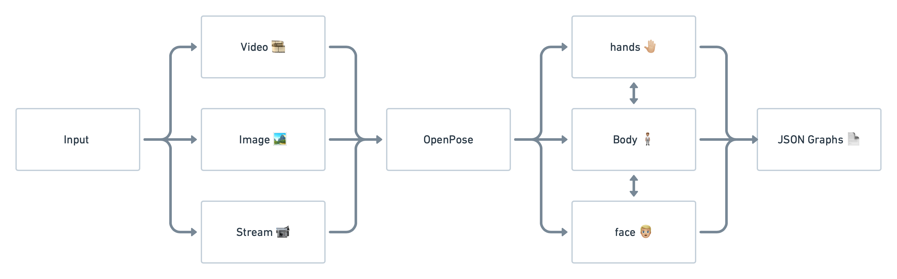

[![Contributors][contributors-shield]][contributors-url]
[![MIT License][license-shield]][license-url]
<!--[![LinkedIn][linkedin-shield]][linkedin-url]-->

<!-- PROJECT LOGO -->
 

  
    <h3 align="center">GraphParser</h3>
    

      Graph Representations to Model Physical Systems
       
      <a href="https://github.com/gabecarra/Bachelor-Project/blob/master/docs/utils.md"><strong>Explore the docs »</strong></a>
       
       
      <a href="https://github.com/github_username/repo">View Demo </a>
      ·
      <a href="https://github.com/github_username/repo/issues">Project Report</a>
     

___

### **Bachelor project 2020 - Machine Learning - USI**
**Advisor:** Prof. Cesare Alippi

**Co-advisors:** Andrea Cini & Daniele Zambon

<!-- TABLE OF CONTENTS -->
## Table of Contents

* [About the Project](#about-the-project)
  * [Built With](#built-with)
* [License](#license)
* [Contact](#contact)

<!-- ABOUT THE PROJECT -->
## About The Project

    

The following project consists in a python package that applies 2D multi-person pose estimation to images and videos, and parses the results into attributed graphs. The goal of this project is to make available an all-in-one tool to build datasets based on real time 2D multi-person detection, and is part of my bachelor project at USI.

The software pipeline works with images, videos or even real time input streams. It uses OpenPose to parse the given frames into keypoints and generates JSON files, containing a clear and rich representation of attributed graphs for each detected person.

Some utilities for example for converting the data from a JSON structured graph, to a more standard representation such as the NetworkX format are available. For more info look at the documentation.

### Built With

* [Python](https://www.python.org)
* [Anaconda](https://www.anaconda.com)
* [Networkx](https://networkx.github.io)
* [Spektral](https://spektral.graphneural.network)
* [MPII Human Pose Dataset](http://human-pose.mpi-inf.mpg.de)
* [Matlab](http://www.mathworks.com)

<!-- LICENSE -->
## License

Distributed under the MIT License. See `LICENSE` for more information.

Logo made by [Becris](https://www.flaticon.com/authors/becris) from www.flaticon.com

<!-- CONTACT -->
## Contact

Gabriel Henrique Carraretto - carrag@usi.ch

Project Link: [https://github.com/gabecarra/Bachelor-Project](https://github.com/gabecarra/Bachelor-Project)

[contributors-shield]: https://img.shields.io/badge/contributors-1-brightgreen?style=flat-square
[contributors-url]: https://github.com/gabecarra/Bachelor-Project/graphs/contributors
[license-shield]: https://img.shields.io/badge/license-MIT-blue?style=flat-square
[license-url]: https://github.com/gabecarra/Bachelor-Project/blob/master/LICENSE
[linkedin-shield]: https://img.shields.io/badge/-LinkedIn-black.svg?style=flat-square&logo=linkedin&colorB=555
<!-- [linkedin-url]:  -->
