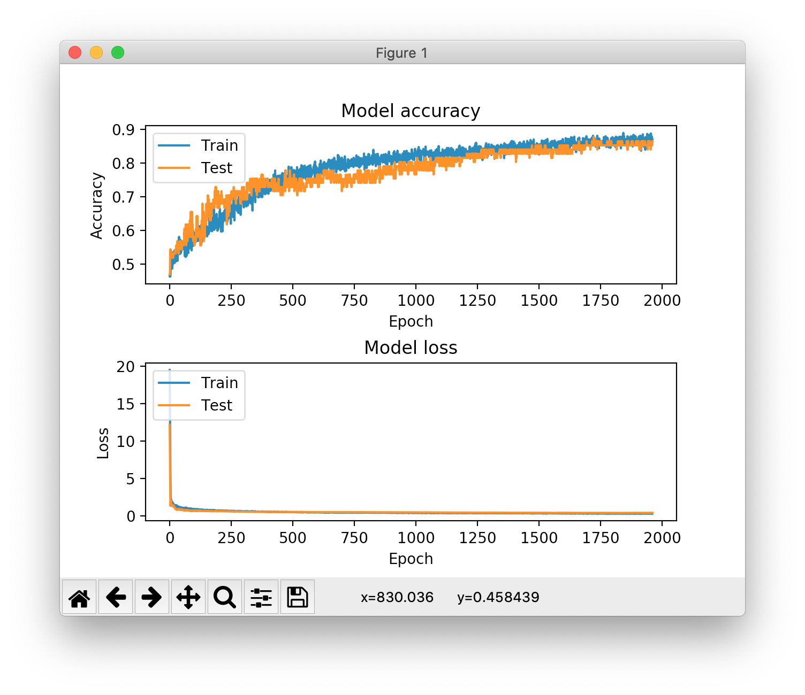

# classifier_example

Parses the main dataset in order to retrieve the graph representations
of people running and cycling, then uses a CNN to learn the relations
between the people and the given category, in order to classify the data.
Currently, the accuracy of the model fluctuates between 75% and 85%. Below
there is a graphical representation of the accuracy and loss function between
the training and testing datasets used for the model creation:

